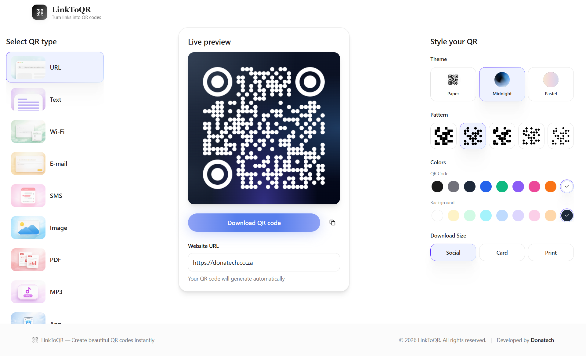

# LinkToQR

LinkToQR is a cost free QR code generator that looks professional, and is UX friendly that everyone can use it without any difficulty. The technical parts are already handled. Mobile responsiveness, live QR preview rendering, file upload infrastructure, and input validation are all done.

One page comes ready to go: a three-pane workspace with a QR type selector sidebar, a live preview panel, and a style customization panel. Nine QR code types are built in (URL, Text, Wi-Fi, Email, SMS, Image, PDF, MP3, and App Store links), along with three visual theme presets, five pattern styles, a full color picker, and three download size options. Every input auto-generates the QR code in real time.

Instead of paying R350 or more per month for a branded QR code platform you barely control, you get a complete tool in hours, fully customizable, with no recurring fees.



## Features & capabilities

- Nine QR Code Types: URL, Text, Wi-Fi, Email, SMS, Image, PDF, MP3, and App Store links all encoded correctly without writing parsing logic yourself.
- Three Theme Presets: Paper, Midnight, and Pastel visual styles with mesh gradients let you match brand aesthetics in one click.
- Five Pattern Styles: Square, Dots, Rounded, Diamond, and Classy body shapes give you design variety without custom SVG work.
- Full Color Customization: Preset swatches plus a hex color picker let you dial in exact brand colors for foreground and background.
- Three Download Sizes: Social (500px), Card (800px), and Print (1200px) presets remove guesswork about output quality for any use case.
- Wi-Fi Credential Encoding: WPA, WEP, and open network support with proper WIFI: string formatting for restaurant menus and retail signage.
- Validated File Uploads: Magic-byte verification, MIME checking, and 10MB limits ensure only safe files generate QR codes on your site.
- Rate-Limited Backend: 15 uploads per hour per IP prevents abuse without any configuration, protecting your Supabase resources automatically.
- Responsive Mobile Layout: Three-pane desktop workspace collapses to a single-column mobile view with dropdown selector for any device.
- Highest Error Correction: Every QR uses level H error correction, staying scannable even when printed small or partially obscured.
- Per-Type State Preservation: Switch between QR types without losing your inputs each type remembers its own content as you work.
- One-Click Copy and Download: Pill download button with visual feedback and icon copy button make exporting QR codes fast and intuitive.

**Use your preferred IDE**

If you want to work locally using your own IDE, you can clone this repo and push changes.

The only requirement is having Node.js & npm installed.

Follow these steps:

```sh
# Step 1: Clone the repository using the project's Git URL.
git clone <YOUR_GIT_URL>

# Step 2: Navigate to the project directory.
cd <YOUR_PROJECT_NAME>

# Step 3: Install the necessary dependencies.
npm i

# Step 4: Start the development server with auto-reloading and an instant preview.
npm run dev
```

**Edit a file directly in GitHub**

- Navigate to the desired file(s).
- Click the "Edit" button (pencil icon) at the top right of the file view.
- Make your changes and commit the changes.

**Use GitHub Codespaces**

## What technologies are used for this project?

This project is built with:

- Vite
- TypeScript
- React
- shadcn-ui
- Tailwind CSS
- Navigate to the main page of your repository.
- Click on the "Code" button (green button) near the top right.
- Select the "Codespaces" tab.
- Click on "New codespace" to launch a new Codespace environment.
- Edit files directly within the Codespace and commit and push your changes once you're done.
